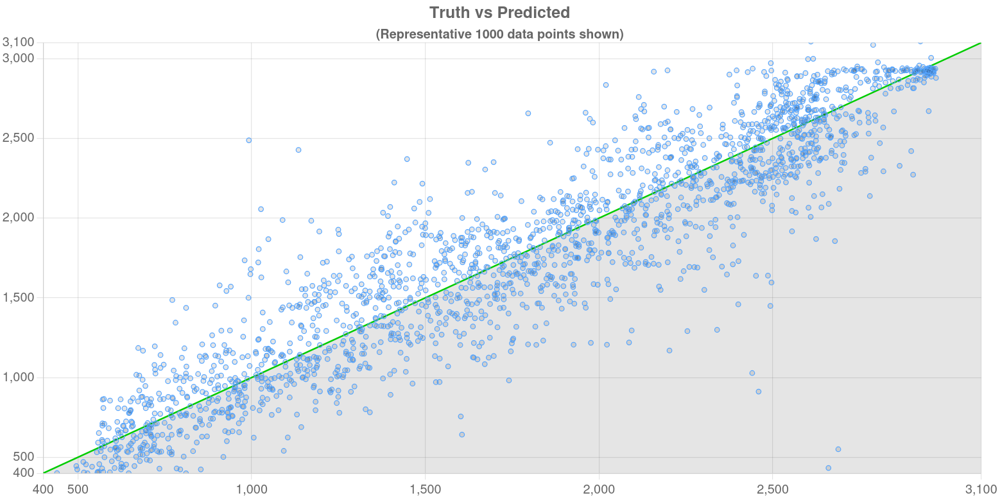
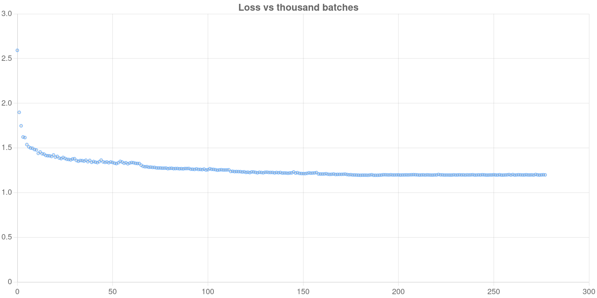

# Chess Elo Guesser

This is a full-stack project which you can submit a chess game to be analyzed by an AI, to guess your Lichess Elo on
each move. It is useful because I think it is fun to see what level you thought you played at vs what an AI thought you
played at.

## How to use

Go to [ceg.honeybuggy.com](https://ceg.honeybuggy.com)

## Code Explanation
All the data was prepared in the DataParsing folder. In there is a Kotlin file which loads training data from a pgn file. It can load into either the data folder or the test_data folder so the training part knows where to look.
For training, there is a folder called Python/main which contains the data loading, model, and training script. 

There is also a file inside Python called server.py which is what is used to talk to the front end. The frontend is located in the folder called Frontend. 

There may also be other miscellaneous files I never cleaned up (lol).

## How is the point estimate calculated?

It is calculated by finding the rating value x that produces the least mean squared difference between the model’s output and a normal
distribution centered at x with standard deviation 200.

---

## Technical Details

### Data and Training

- The dataset started out with about 900,000,000 games sourced from the Lichess public database.
- Games were filtered to only include "Rated Blitz" games with more than 10 half-moves.
- Games were then placed into groups of interval 100 based on the average Elo of both players (400–499, 500–599, ...,
  3000–3099).
- The final training dataset included 2,451,672 games, selected using stratified random sampling. The sampling was
  balanced so that the largest group contributed no more than four times as many games as the smallest group.

### Labels

- Each game's Elo was converted into a soft target using a normal distribution centered on the true Elo (σ = 200), and
  integrated across output brackets.
- Training was done for over 7 epochs with batch size 64.
- Loss was calculated using Kullback-Leibler loss across all time-steps.

### Architecture

Each board "frame" is turned into an embedding in the following process:

1. For each square, a learned piece embedding is summed with a learned square embedding.
2. Special learned embeddings are added to the *from* and *to* squares for each move. If the move is a promotion, a
   separate promotion embedding is added to the *to* square.
3. The resulting board representation is passed through a Convolutional Neural Network (CNN) to create an embedding.

These embeddings are then alternatingly routed (e.g., [1,2,3,4] → [1,3], [2,4]) into two LSTM networks (one for White,
one for Black).

This CNN-LSTM architecture was chosen because it offered significantly faster inference relative to transformer models,
and uses CNN strengths for spatial pattern recognition.

To compute the point estimate, the model finds the value of `x` that minimizes the mean squared error between a normal
distribution (mean=`x`, σ=200) integrated over Elo brackets and the model’s predicted distribution.

### Performance Metrics

- Evaluated on 10,000 unseen games with >30 half-moves.
- Achieved an R² of 0.86, showing a strong correlation between predicted and actual Elo.
- Achieved an R-MSE of 277.

### For people doing something similar

**What worked well:**

- Using a Convolutional Neural Network to analyze board positions.
- Using an LSTM allows for move-by-move evaluations.
- Using separate LSTMs for each player.
- Using soft targets in the form of KL-Divergence loss.

**What to avoid:**

- Using only the move sequence instead of board images (resulted in worse performance).
- Using hard targets such as cross-entropy loss (slow convergence).
- Using a single point target such as MSE (model tended to predict mean values).
- Using a single LSTM (model predicted similar outputs for both players).

**Things to try:**

- Expanding labels beyond 400–3000 so distributions on the edge are not skewed.
- Using a transformer to output final distributions, since Lichess games are capped at 300 half-moves.
- Trying alternative target distributions beyond a static normal distribution.

### Limitations

- **Time controls/Variants:** The model was trained only on standard blitz. Performance on bullet, rapid, classical, or
  variants may be unreliable.
- **Hyperparameter tuning:** Parameters were chosen via random sampling rather than formal optimization; performance may
  be further improved.

### Future Work

1. Expand to other time controls.
2. Release a lighter model for low-resource usage.
3. Release a heavier model to further reduce R-MSE.

### Charts:

---

## Attributions

This project uses the following open-source libraries:

- **python-chess** (GPL 3 License):  
  https://python-chess.readthedocs.io/en/latest/

- **Flask** (BSD 3-Clause License):  
  https://flask.palletsprojects.com/en/stable/

- **Flask-Limiter** (MIT License):  
  https://flask-limiter.readthedocs.io/en/stable/

- **Flask-CORS** (MIT License):  
  https://pypi.org/project/flask-cors/

- **PyTorch** (BSD 3-Clause License):  
  https://pytorch.org/

- **NumPy** (BSD 3-Clause License):  
  https://numpy.org/

- **SciPy** (BSD 3-Clause License):  
  https://scipy.org/

- **msgpack-python** (Apache-2.0 License):  
  https://github.com/msgpack/msgpack-python

- **msgpack-java** (Apache-2.0 License):  
  https://github.com/msgpack/msgpack-java

- **chesslib** (Apache-2.0 License):  
  https://github.com/bhlangonijr/chesslib

- **zstd-jni** (BSD 2-Clause License):  
  https://github.com/luben/zstd-jni

- **chess.js** (BSD 2-Clause License):  
  https://github.com/jhlywa/chess.js

- **Chessground** (GPL-3.0 License):  
  https://github.com/lichess-org/chessground

- **Chart.js** (MIT License):  
  https://www.chartjs.org/

- **Bootstrap 5** (MIT License):  
  https://getbootstrap.com/

- **Bootstrap Icons** (MIT License):  
  https://icons.getbootstrap.com/

- **Font Awesome** (MIT License):  
  https://cdnjs.com/libraries/font-awesome

- **MathJax** (Apache-2.0 License):  
  https://www.mathjax.org/

All licenses in `licenses/`
